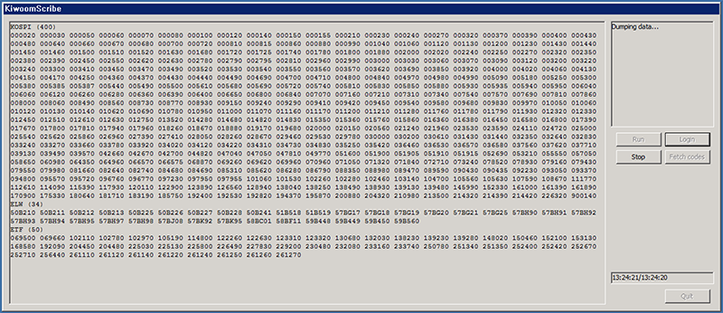

# KiwoomScribe

KiwoomScribe is an application for dumping real-time intraday Stock/ETF/ELW
tick data in South Korean KOSPI market using *Kiwoom Securities* OpenAPI.

It records
- For all: level 1 (top of the book quotes and trades) and partial level 2
           (order book up to ±10 ticks) data with 1 second resolution
- For ETF: Net Asset Value (NAV) and its related measures
- For ELW: theoretical option value (V), implied volatility (𝜎),
           Greeks (𝛥, 𝛤, 𝛩, 𝜈, 𝜌), and liquidity provider's order book
- KOSPI200 index (the base for many of the ETF/ELW items in this market)

Zipped full-day data can be used for backtesting using `simserv` in
[Sibyl](https://github.com/junosan/Sibyl) repository.

## Requirements
- A trading account at *Kiwoom Securities*
- *Kiwoom Securities* OpenAPI (after installing, OpenAPI feature also needs to
  be activated on on their website)
- Visual C++ Redistributable for Visual Studio 2015 Update 2
  (or versions compatible with it)

## How to use
- `config.ini` sets the codes of Stock/ETF/ELW whose data will be collected
- At the time of writing, the KOSPI market generates first data at `07:30 KST`
  and last data at `16:00 KST`, so this application should be started/stopped
  before/after those time points
- Before `Quit`ting, using `Fetch codes` button collects certain numbers of
  ETF/ELW items sorted by trade volume during that day (this calls command
  line program `FetchCode/FetchCode.exe` and modifies `config.ini` accordingly)

## Notes
- See CKiwoomScribeDlg::OnReceiveRealData for data format
- Due to the human-intervention-inviting update procedure of
  *Kiwoom Securities* OpenAPI, the login cannot be reliably automated.
  Hence, it is recommended that this program be started/stopped manually.
- Due to restrictions of *Kiwoom Securities* OpenAPI, any Korean text appearing
  in their API must be in EUC-KR encoding, and their API malfuctions severely
  under a Unicode compile environment.
  Hence, the project itself is also built in that encoding, and some source
  code files contain text in that encoding (yes, they have built their API
  in a way that cannot be used without EUC-KR Korean text in source codes).
  These source code files, some data files (`$i.txt` files for ELW),
  and `config.ini` are in EUC-KR, which will need special care if being
  opened, and especially if being re-saved, in *nix enviroments.
  These are not files containing timestamped data.
